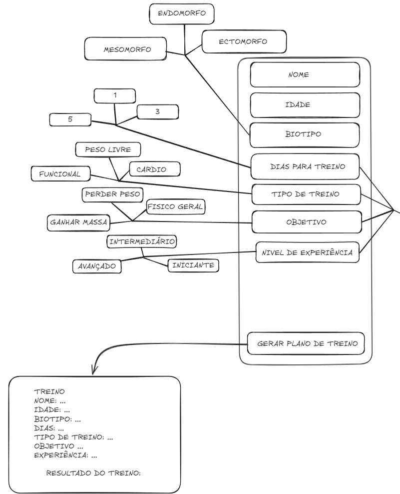
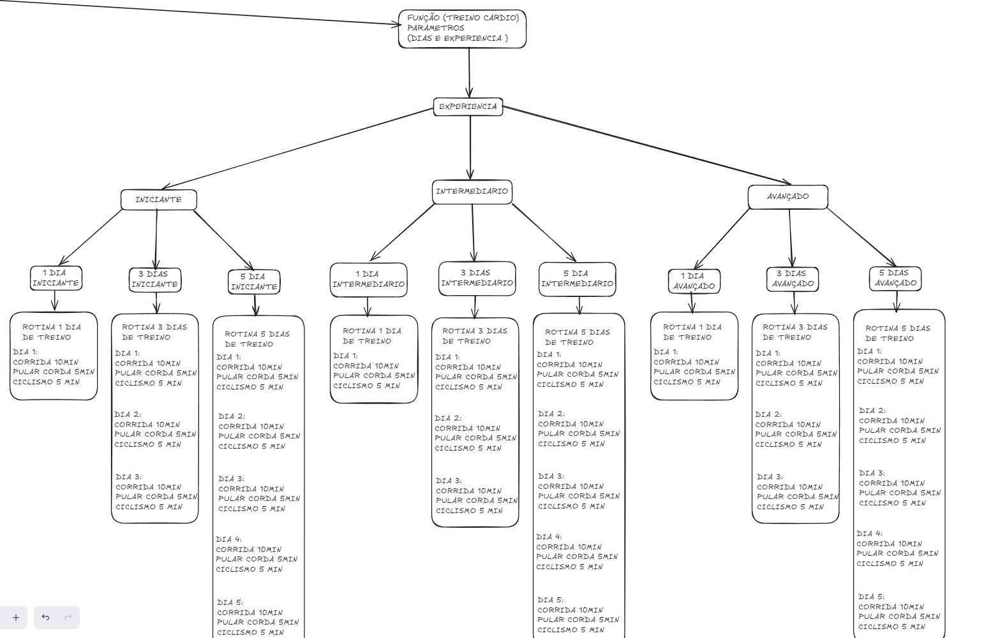
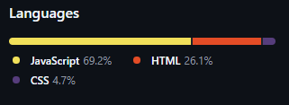
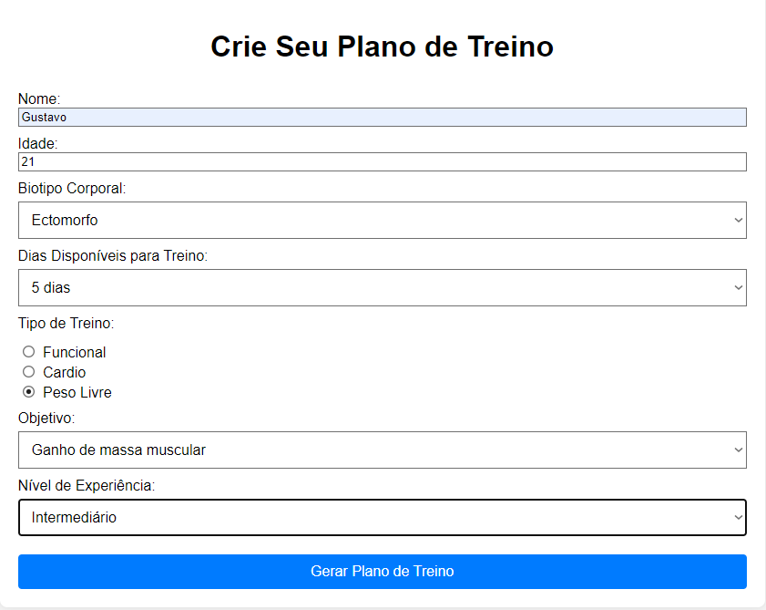
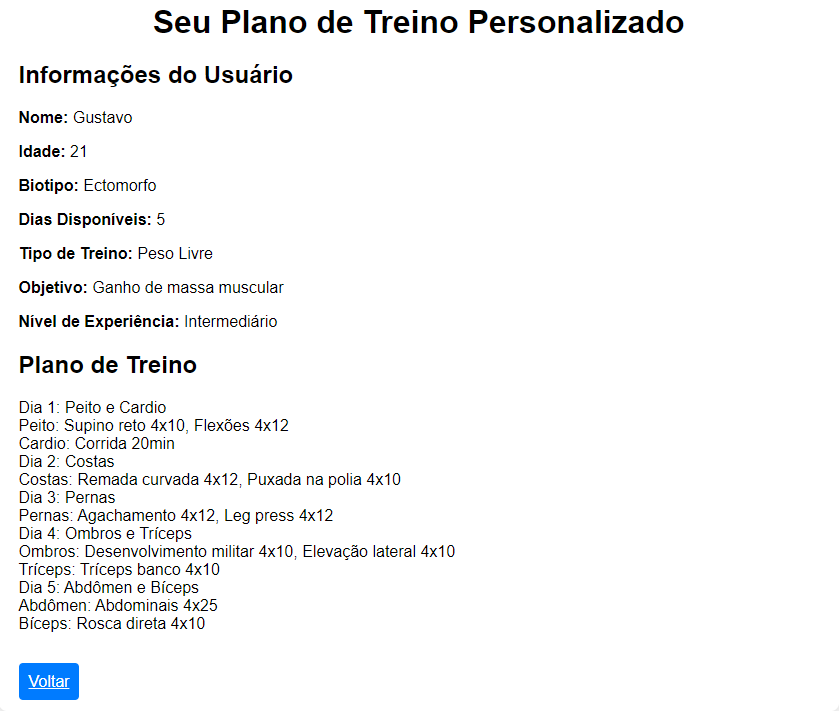

## Personal Web

Este projeto é uma aplicação web interativa que gera planos de treino personalizados com base nos dados fornecidos pelo usuário, como o tipo de treino, objetivo, nível de experiência e dias disponíveis. A aplicação oferece opções de treino Funcional, Cardio e Peso Livre, com rotinas detalhadas para ganho de massa muscular, perda de gordura e condicionamento físico geral.

## Funcionalidades
* Treino Funcional: Rotinas que combinam exercícios de cardio com exercícios de força, ideais para melhorar a resistência física.
* Treino Cardio: Focado em atividades aeróbicas, como corrida e pular corda, com variações para diferentes níveis de experiência.
* Treino de Peso Livre: Rotinas adaptadas para ganho de massa muscular ou perda de gordura, com foco em exercícios de força como supino, agachamentos e levantamento de pesos.

Cada rotina de treino é personalizada com base no nível de experiência do usuário (iniciante, intermediário ou avançado) e no número de dias de treino por semana (1, 3 ou 5 dias).

## Estrutura do Projeto

### Estrutura principal

### Estrutura da lógica

Obs: É uma representação da estrutura e lógica do projeto, os valores foram alterados.

## Tecnologias Utilizadas
* **HTML5**: Estrutura das páginas web.

* **CSS3**: Estilização do layout e dos componentes.

* **JavaScript**: Lógica de geração de rotinas de treino e manipulação de interações do usuário.

## Como Utilizar

Acesse o link: https://personalwebhgp.netlify.app

### Preencha com seus dados e clique em `Gerar Plano de Treino`

### Resultado

## Melhorias Futuras

* Vincular ao banco de dados para criar um histórico.
* Fazer uma análise estatística do histórico.
* Ajustar as saídas dos treinos para valores mais próximos da realidade.
* Melhorar Design.

## Contribuições
Sinta-se à vontade para contribuir com melhorias no código, correções de bugs ou novas funcionalidades.
* Faça um fork do projeto.
* Crie uma branch com suas alterações.
* Envie um Pull Request.

## Autor
**Guustavohgp**